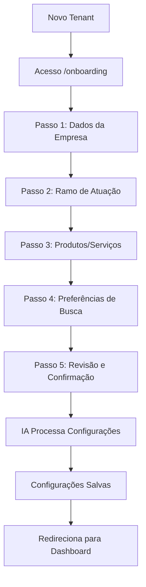
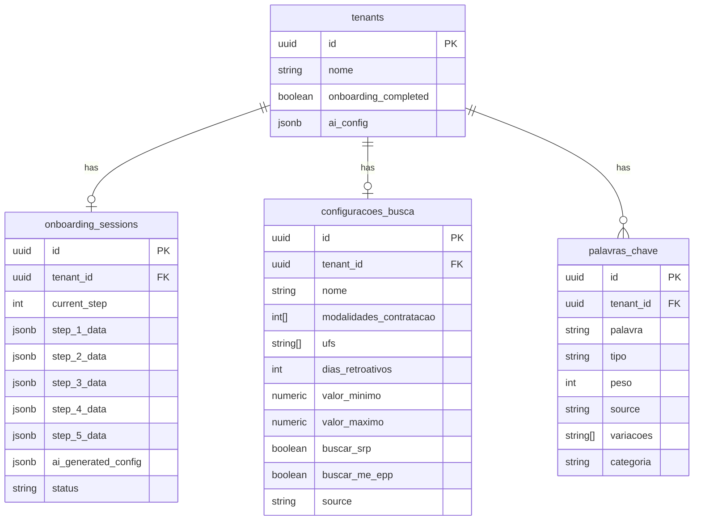
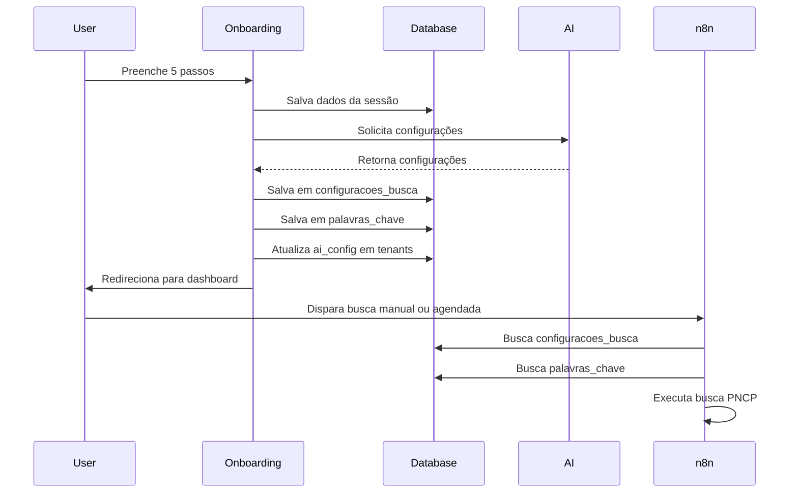

# Arquitetura do Onboarding com IA - LicitaIA

> **Versão:** 1.0  
> **Data:** Fevereiro 2026  
> **Autor:** Arquitetura de Software

## 1. Visão Geral

O Onboarding com IA é um wizard de 5 passos que permite que novas empresas configurem automaticamente sua conta no LicitaIA. A IA analisa as informações do negócio e gera configurações personalizadas de busca, keywords e prompts de análise.

### 1.1 Objetivos

- Reduzir o tempo de configuração inicial de horas para minutos
- Gerar configurações relevantes baseadas no perfil do negócio
- Melhorar a qualidade das análises com prompts personalizados
- Facilitar a adoção por novos clientes

### 1.2 Fluxo de Alto Nível



---

## 2. Wizard de 5 Passos

### Passo 1: Dados da Empresa

**Objetivo:** Coletar informações básicas da empresa.

**Campos coletados:**
| Campo | Tipo | Obrigatório | Descrição |
|-------|------|-------------|-----------|
| `razao_social` | string | Sim | Razão social da empresa |
| `nome_fantasia` | string | Não | Nome fantasia |
| `cnpj` | string | Sim | CNPJ (para validação) |
| `porte` | enum | Sim | ME, EPP, MEI, DEMAIIS |
| `setor` | enum | Sim | COMERCIO, SERVICOS, INDUSTRIA, MIXTO |
| `descricao_livre` | textarea | Não | Descrição em texto livre do negócio |

**Validações:**
- CNPJ deve ter 14 dígitos
- Porte influencia sugestões de keywords (ME/EPP)

**UX:**
- Formulário simples com validação em tempo real
- Tooltip explicativo sobre porte ME/EPP

---

### Passo 2: Ramo de Atuação

**Objetivo:** Identificar a área de atuação principal para gerar keywords relevantes.

**Campos coletados:**
| Campo | Tipo | Obrigatório | Descrição |
|-------|------|-------------|-----------|
| `ramo_principal` | select | Sim | Ramo principal de atuação |
| `ramo_secundario` | multi-select | Não | Ramos secundários |
| `experiencia_pregao` | boolean | Sim | Já participou de pregões? |
| `tipos_clientes` | multi-select | Sim | Governo Federal, Estadual, Municipal, Privado |

**Ramos disponíveis:**
```json
[
  { "id": "GRAFICO", "nome": "Gráfica e Comunicação Visual", "keywords_base": ["gráfica", "impressão", "material gráfico"] },
  { "id": "TI", "nome": "Tecnologia da Informação", "keywords_base": ["software", "sistema", "TI", "informática"] },
  { "id": "CONSTRUCAO", "nome": "Construção Civil", "keywords_base": ["construção", "obra", "engenharia"] },
  { "id": "ALIMENTOS", "nome": "Alimentos e Bebidas", "keywords_base": ["alimentação", "merenda", "alimentos"] },
  { "id": "TRANSPORTE", "nome": "Transporte e Logística", "keywords_base": ["transporte", "frete", "logística"] },
  { "id": "SAUDE", "nome": "Saúde e Medicamentos", "keywords_base": ["saúde", "medicamento", "hospitalar"] },
  { "id": "EDUCACAO", "nome": "Educação e Treinamento", "keywords_base": ["educação", "curso", "treinamento"] },
  { "id": "LIMPEZA", "nome": "Limpeza e Conservação", "keywords_base": ["limpeza", "conservação", "jardinagem"] },
  { "id": "EQUIPAMENTOS", "nome": "Equipamentos e Materiais", "keywords_base": ["equipamento", "material", "fornecimento"] },
  { "id": "SERVICOS_GERAIS", "nome": "Serviços Gerais", "keywords_base": ["serviço", "terceirização"] },
  { "id": "OUTRO", "nome": "Outro", "keywords_base": [] }
]
```

**UX:**
- Cards visuais para seleção de ramos
- Chips para seleção múltipla de tipos de clientes

---

### Passo 3: Produtos e Serviços

**Objetivo:** Detalhar os produtos/serviços específicos para gerar keywords precisas.

**Campos coletados:**
| Campo | Tipo | Obrigatório | Descrição |
|-------|------|-------------|-----------|
| `produtos_servicos` | textarea | Sim | Lista de produtos/serviços principais |
| `palavras_chave_manual` | tags | Não | Keywords que o cliente já conhece |
| `exclusoes` | textarea | Não | O que NÃO quer buscar |

**Exemplo de entrada:**
```
Produtos: Impressão offset, impressão digital, banners, folders, cartões de visita, material promocional
Exclusões: Não trabalho com serigrafia, não faço instalação de outdoors
```

**UX:**
- Textarea com sugestões baseadas no ramo
- Tags interativas para exclusões

---

### Passo 4: Preferências de Busca

**Objetivo:** Configurar filtros geográficos e de modalidade.

**Campos coletados:**
| Campo | Tipo | Obrigatório | Descrição |
|-------|------|-------------|-----------|
| `ufs_interesse` | multi-select | Não | Estados de interesse (vazio = todos) |
| `municipios_interesse` | multi-select | Não | Municípios específicos |
| `modalidades` | multi-select | Sim | Modalidades de interesse |
| `valor_minimo` | number | Não | Valor mínimo de licitação |
| `valor_maximo` | number | Não | Valor máximo de licitação |
| `dias_retroativos` | number | Sim | Dias para trás na busca (default: 15) |

**Modalidades disponíveis (códigos PNCP):**
```json
{
  "1": "Pregão Eletrônico",
  "2": "Concorrência",
  "6": "Dispensa de Licitação",
  "8": "Credenciamento",
  "9": "Pregão Presencial",
  "10": "Regime Diferenciado (RDC)"
}
```

**UX:**
- Mapa interativo para seleção de UFs
- Slider para faixa de valores
- Checkboxes com descrições para modalidades

---

### Passo 5: Revisão e Confirmação

**Objetivo:** Revisar tudo antes de processar com IA.

**Exibição:**
- Resumo de todos os dados coletados
- Preview das configurações que serão geradas
- Opção de editar qualquer passo

**Ações:**
- Botão "Processar com IA" (aciona streaming)
- Botão "Voltar" para editar

**UX:**
- Cards de resumo por seção
- Indicador de progresso
- Loading com streaming de texto

---

## 3. Prompts de IA

### 3.1 Estrutura do Sistema de Prompts

A IA recebe os dados coletados e gera configurações estruturadas. Utilizamos o Vercel AI SDK para streaming.

### 3.2 Prompt Principal (System Prompt)

```markdown
Você é um especialista em licitações públicas brasileiras e no sistema PNCP. 
Sua tarefa é analisar os dados de uma empresa e gerar configurações otimizadas 
para busca e análise de licitações.

## Contexto da Empresa
{{empresa_data}}

## Tarefas

### 1. Keywords de Inclusão
Gere uma lista de 10-20 palavras-chave de inclusão relevantes para o negócio.
Considere:
- Sinônimos e variações (ex: "impressão" → "imprimir", "impresso")
- Termos técnicos do setor
- Códigos de catálogo de materiais quando aplicável
- Termos usados em editais do setor

### 2. Keywords de Exclusão
Gere uma lista de 5-10 palavras-chave de exclusão para filtrar licitações 
não relevantes. Considere:
- Produtos/serviços similares mas não oferecidos
- Setores adjacentes mas não atendidos
- Termos que indicam incompatibilidade

### 3. Filtros de Busca
Sugira configurações de busca otimizadas:
- UFs prioritárias baseadas no porte e logística
- Modalidades mais adequadas ao perfil
- Faixa de valores recomendada

### 4. Prompt de Análise Personalizado
Crie um prompt personalizado para análise de editais que considere:
- Produtos/serviços específicos da empresa
- Critérios de relevância
- Pontos de atenção em editais

## Formato de Resposta
Responda APENAS em JSON válido no seguinte formato:
{
  "keywords_inclusao": [...],
  "keywords_exclusao": [...],
  "filtros_busca": {...},
  "prompt_analise": "...",
  "justificativa": "..."
}
```

### 3.3 Exemplo de Input para IA

```json
{
  "empresa": {
    "razao_social": "Gráfica Silva Ltda",
    "porte": "EPP",
    "setor": "COMERCIO",
    "descricao": "Gráfica especializada em impressão offset e digital para material promocional"
  },
  "ramo": {
    "principal": "GRAFICO",
    "experiencia_pregao": true,
    "tipos_clientes": ["MUNICIPAL", "ESTADUAL"]
  },
  "produtos": {
    "lista": "Impressão offset, impressão digital, banners, folders, cartões de visita",
    "exclusoes": "Serigrafia, instalação de outdoors"
  },
  "preferencias": {
    "ufs": ["MG", "SP", "RJ"],
    "modalidades": [1, 6, 8],
    "valor_minimo": 5000,
    "valor_maximo": 500000
  }
}
```

### 3.4 Exemplo de Output da IA

```json
{
  "keywords_inclusao": [
    "impressão offset",
    "impressão digital",
    "material gráfico",
    "banner",
    "folder",
    "cartão de visita",
    "material promocional",
    "impresso",
    "gráfica",
    "comunicação visual",
    "panfleto",
    "folheto",
    "cartaz",
    "encadernação",
    "reprodução gráfica"
  ],
  "keywords_exclusao": [
    "serigrafia",
    "silk screen",
    "outdoor",
    "instalação",
    "montagem de painel",
    "sinalização vertical"
  ],
  "filtros_busca": {
    "ufs_prioritarias": ["MG", "SP", "RJ"],
    "modalidades_recomendadas": [1, 6, 8],
    "valor_minimo_sugerido": 5000,
    "valor_maximo_sugerido": 500000,
    "dias_retroativos": 15,
    "buscar_srp": true,
    "buscar_me_epp": true
  },
  "prompt_analise": "Analise este edital para uma gráfica EPP especializada em impressão offset e digital.\n\nPRODUTOS OFERECIDOS:\n- Impressão offset (até 4 cores)\n- Impressão digital (grandes formatos)\n- Banners, folders, cartões de visita\n\nCRITÉRIOS DE RELEVÂNCIA:\n1. Verificar se há itens de impressão gráfica\n2. Identificar se há exigência de amostra técnica\n3. Verificar qualificação técnica exigida\n4. Identificar restrições de porte (ME/EPP)\n5. Calcular valor relevante (soma dos itens de impressão)\n\nPONTOS DE ATENÇÃO:\n- Prazos de entrega\n- Exigências de certificação\n- Modalidade de participação (SRP, ME/EPP)\n- Garantias exigidas",
  "justificativa": "Configuração otimizada para gráfica EPP com foco em impressão. Keywords incluem variações técnicas e termos comuns em editais. Filtros focados na região Sudeste onde a empresa atua. Prompt de análise personalizado para identificar oportunidades relevantes."
}
```

---

## 4. Estrutura de Dados

### 4.1 Tabela de Onboarding (Nova)

```sql
-- Migration: 006_onboarding.sql

CREATE TABLE IF NOT EXISTS onboarding_sessions (
  id UUID PRIMARY KEY DEFAULT gen_random_uuid(),
  tenant_id UUID NOT NULL REFERENCES tenants(id) ON DELETE CASCADE,
  current_step INT NOT NULL DEFAULT 1,
  step_1_data JSONB DEFAULT '{}',
  step_2_data JSONB DEFAULT '{}',
  step_3_data JSONB DEFAULT '{}',
  step_4_data JSONB DEFAULT '{}',
  step_5_data JSONB DEFAULT '{}',
  ai_generated_config JSONB DEFAULT '{}',
  status TEXT NOT NULL DEFAULT 'IN_PROGRESS' CHECK (status IN ('IN_PROGRESS', 'COMPLETED', 'SKIPPED')),
  created_at TIMESTAMPTZ DEFAULT NOW(),
  updated_at TIMESTAMPTZ DEFAULT NOW(),
  completed_at TIMESTAMPTZ
);

CREATE INDEX idx_onboarding_tenant ON onboarding_sessions(tenant_id);
CREATE INDEX idx_onboarding_status ON onboarding_sessions(status);
```

### 4.2 Extensão da Tabela tenants

```sql
-- Colunas já existentes (confirmadas em migration 001)
ALTER TABLE tenants ADD COLUMN IF NOT EXISTS onboarding_completed BOOLEAN DEFAULT FALSE;
ALTER TABLE tenants ADD COLUMN IF NOT EXISTS ai_config JSONB DEFAULT '{}';

-- Estrutura do ai_config
COMMENT ON COLUMN tenants.ai_config IS '{
  "keywords_inclusao": ["string"],
  "keywords_exclusao": ["string"],
  "prompt_analise": "string",
  "filtros_recomendados": {},
  "generated_at": "ISO date",
  "model_version": "string"
}';
```

### 4.3 Extensão da Tabela configuracoes_busca

```sql
-- Adicionar campos de configuração de busca
ALTER TABLE configuracoes_busca ADD COLUMN IF NOT EXISTS valor_minimo NUMERIC DEFAULT 0;
ALTER TABLE configuracoes_busca ADD COLUMN IF NOT EXISTS valor_maximo NUMERIC DEFAULT NULL;
ALTER TABLE configuracoes_busca ADD COLUMN IF NOT EXISTS buscar_srp BOOLEAN DEFAULT TRUE;
ALTER TABLE configuracoes_busca ADD COLUMN IF NOT EXISTS buscar_me_epp BOOLEAN DEFAULT TRUE;
ALTER TABLE configuracoes_busca ADD COLUMN IF NOT EXISTS source TEXT DEFAULT 'MANUAL' CHECK (source IN ('MANUAL', 'AI_GENERATED', 'HYBRID'));
```

### 4.4 Extensão da Tabela palavras_chave

```sql
-- Adicionar campos para rastrear origem
ALTER TABLE palavras_chave ADD COLUMN IF NOT EXISTS source TEXT DEFAULT 'MANUAL' CHECK (source IN ('MANUAL', 'AI_GENERATED', 'IMPORTED'));
ALTER TABLE palavras_chave ADD COLUMN IF NOT EXISTS variacoes TEXT[] DEFAULT '{}';
ALTER TABLE palavras_chave ADD COLUMN IF NOT EXISTS categoria TEXT;
```

### 4.5 Diagrama ER



---

## 5. APIs Necessárias

### 5.1 API de Onboarding Session

#### Criar/Recuperar Sessão

```
GET /api/onboarding/session
```

**Response:**
```json
{
  "session": {
    "id": "uuid",
    "current_step": 2,
    "step_1_data": {...},
    "step_2_data": {...},
    "status": "IN_PROGRESS"
  }
}
```

#### Salvar Passo

```
POST /api/onboarding/session
```

**Body:**
```json
{
  "step": 2,
  "data": {
    "ramo_principal": "GRAFICO",
    "experiencia_pregao": true
  }
}
```

#### Completar Onboarding

```
POST /api/onboarding/complete
```

**Response:**
```json
{
  "success": true,
  "redirect": "/dashboard"
}
```

### 5.2 API de Geração com IA (Streaming)

```
POST /api/onboarding/generate
```

**Body:**
```json
{
  "session_id": "uuid"
}
```

**Response (Streaming):**
```
data: {"type": "thinking", "content": "Analisando ramo de atuação..."}
data: {"type": "keywords_inclusao", "content": ["impressão", "gráfica"]}
data: {"type": "keywords_exclusao", "content": ["serigrafia"]}
data: {"type": "filtros", "content": {...}}
data: {"type": "prompt", "content": "..."}
data: {"type": "done", "content": "Configuração gerada com sucesso!"}
```

### 5.3 Implementação da API de Streaming

```typescript
// src/app/api/onboarding/generate/route.ts
import { streamText } from 'ai';
import { openai } from '@ai-sdk/openai';
import { getEffectiveTenantId } from '@/lib/tenant';
import { query, queryOne } from '@/lib/db';

const SYSTEM_PROMPT = `...`; // Conforme seção 3.2

export async function POST(req: Request) {
  const { tenantId } = await getEffectiveTenantId();
  
  // Buscar dados da sessão
  const session = await queryOne(
    'SELECT * FROM onboarding_sessions WHERE tenant_id = $1',
    [tenantId]
  );
  
  if (!session) {
    return new Response('Session not found', { status: 404 });
  }
  
  // Montar contexto para IA
  const context = {
    empresa: { ...session.step_1_data, ...session.step_4_data },
    ramo: session.step_2_data,
    produtos: session.step_3_data,
    preferencias: session.step_4_data
  };
  
  // Streaming com Vercel AI SDK
  const result = streamText({
    model: openai('gpt-4o'),
    system: SYSTEM_PROMPT,
    prompt: JSON.stringify(context),
  });
  
  return result.toDataStreamResponse();
}
```

### 5.4 API de Validação de Keywords

```
POST /api/onboarding/validate-keywords
```

**Body:**
```json
{
  "keywords": ["impressão", "gráfica", "banner"]
}
```

**Response:**
```json
{
  "valid": true,
  "suggestions": [
    {"keyword": "impressão", "variacoes": ["impresso", "imprimir"]},
    {"keyword": "banner", "variacoes": ["faixa", "faixada"]}
  ],
  "warnings": []
}
```

---

## 6. Componentes Frontend

### 6.1 Estrutura de Arquivos

```
src/app/(onboarding)/
├── layout.tsx              # Layout sem sidebar
├── onboarding/
│   ├── page.tsx            # Página principal do wizard
│   ├── components/
│   │   ├── WizardProgress.tsx
│   │   ├── Step1Empresa.tsx
│   │   ├── Step2Ramo.tsx
│   │   ├── Step3Produtos.tsx
│   │   ├── Step4Preferencias.tsx
│   │   ├── Step5Revisao.tsx
│   │   └── AIStreamingDisplay.tsx
│   └── hooks/
│       └── useOnboarding.ts
```

### 6.2 Componente Principal

```tsx
// src/app/(onboarding)/onboarding/page.tsx
'use client';

import { useState, useEffect } from 'react';
import { useRouter } from 'next/navigation';
import { useOnboarding } from './hooks/useOnboarding';
import WizardProgress from './components/WizardProgress';
import Step1Empresa from './components/Step1Empresa';
import Step2Ramo from './components/Step2Ramo';
import Step3Produtos from './components/Step3Produtos';
import Step4Preferencias from './components/Step4Preferencias';
import Step5Revisao from './components/Step5Revisao';

const STEPS = [
  { component: Step1Empresa, title: 'Sua Empresa' },
  { component: Step2Ramo, title: 'Ramo de Atuação' },
  { component: Step3Produtos, title: 'Produtos e Serviços' },
  { component: Step4Preferencias, title: 'Preferências' },
  { component: Step5Revisao, title: 'Revisão' },
];

export default function OnboardingPage() {
  const [currentStep, setCurrentStep] = useState(0);
  const { session, saveStep, complete, isLoading } = useOnboarding();
  const router = useRouter();
  
  const StepComponent = STEPS[currentStep].component;
  
  const handleNext = async (data: Record<string, unknown>) => {
    await saveStep(currentStep + 1, data);
    if (currentStep < STEPS.length - 1) {
      setCurrentStep(currentStep + 1);
    }
  };
  
  const handleComplete = async () => {
    await complete();
    router.push('/dashboard');
  };
  
  return (
    <div className="min-h-screen bg-slate-900">
      <div className="max-w-3xl mx-auto py-12 px-4">
        <WizardProgress 
          steps={STEPS.map(s => s.title)} 
          current={currentStep} 
        />
        
        <div className="mt-8">
          <StepComponent
            data={session?.[`step_${currentStep + 1}_data`] || {}}
            onNext={handleNext}
            onComplete={handleComplete}
            onBack={() => setCurrentStep(currentStep - 1)}
            isLoading={isLoading}
            isFirstStep={currentStep === 0}
            isLastStep={currentStep === STEPS.length - 1}
          />
        </div>
      </div>
    </div>
  );
}
```

### 6.3 Hook de Onboarding

```typescript
// src/app/(onboarding)/onboarding/hooks/useOnboarding.ts
import { useState, useEffect, useCallback } from 'react';

interface OnboardingSession {
  id: string;
  current_step: number;
  step_1_data: Record<string, unknown>;
  step_2_data: Record<string, unknown>;
  step_3_data: Record<string, unknown>;
  step_4_data: Record<string, unknown>;
  step_5_data: Record<string, unknown>;
  ai_generated_config: Record<string, unknown>;
  status: 'IN_PROGRESS' | 'COMPLETED' | 'SKIPPED';
}

export function useOnboarding() {
  const [session, setSession] = useState<OnboardingSession | null>(null);
  const [isLoading, setIsLoading] = useState(true);
  
  useEffect(() => {
    fetchSession();
  }, []);
  
  const fetchSession = async () => {
    try {
      const res = await fetch('/api/onboarding/session');
      if (res.ok) {
        const data = await res.json();
        setSession(data.session);
      }
    } finally {
      setIsLoading(false);
    }
  };
  
  const saveStep = useCallback(async (step: number, data: Record<string, unknown>) => {
    setIsLoading(true);
    try {
      const res = await fetch('/api/onboarding/session', {
        method: 'POST',
        headers: { 'Content-Type': 'application/json' },
        body: JSON.stringify({ step, data }),
      });
      if (res.ok) {
        const updated = await res.json();
        setSession(updated.session);
      }
    } finally {
      setIsLoading(false);
    }
  }, []);
  
  const complete = useCallback(async () => {
    setIsLoading(true);
    try {
      await fetch('/api/onboarding/complete', { method: 'POST' });
    } finally {
      setIsLoading(false);
    }
  }, []);
  
  return { session, saveStep, complete, isLoading };
}
```

### 6.4 Componente de Streaming

```tsx
// src/app/(onboarding)/onboarding/components/AIStreamingDisplay.tsx
'use client';

import { useChat } from 'ai/react';

interface Props {
  sessionId: string;
  onComplete: (config: AIConfig) => void;
}

export default function AIStreamingDisplay({ sessionId, onComplete }: Props) {
  const { messages, isLoading } = useChat({
    api: '/api/onboarding/generate',
    body: { session_id: sessionId },
    onFinish: (message) => {
      try {
        const config = JSON.parse(message.content);
        onComplete(config);
      } catch (e) {
        console.error('Failed to parse AI response', e);
      }
    },
  });
  
  return (
    <div className="bg-slate-800 rounded-lg p-6 space-y-4">
      <div className="flex items-center gap-3">
        <div className="w-8 h-8 rounded-full bg-indigo-600 flex items-center justify-center">
          <span className="text-white text-sm">AI</span>
        </div>
        <span className="text-slate-300">
          {isLoading ? 'Analisando sua empresa...' : 'Configuração gerada!'}
        </span>
      </div>
      
      <div className="space-y-2 max-h-96 overflow-y-auto">
        {messages.map((msg, i) => (
          <div key={i} className="text-slate-400 text-sm">
            {msg.content}
          </div>
        ))}
      </div>
      
      {isLoading && (
        <div className="flex items-center gap-2 text-slate-500">
          <div className="w-2 h-2 bg-indigo-500 rounded-full animate-pulse" />
          <span>Processando...</span>
        </div>
      )}
    </div>
  );
}
```

---

## 7. Integração com n8n

### 7.1 Como os Workflows Usam as Configurações

O workflow de busca PNCP já consulta as tabelas `configuracoes_busca` e `palavras_chave`. Após o onboarding, essas tabelas serão populadas automaticamente.

### 7.2 Fluxo de Dados



### 7.3 Modificações no Workflow n8n

O workflow existente já suporta as configurações. Apenas garantir que:

1. **Node "Buscar Config"** busca de `configuracoes_busca` com `source = 'AI_GENERATED'` ou `'MANUAL'`
2. **Node "Buscar Palavras"** busca de `palavras_chave` incluindo `variacoes`
3. **Filtro de busca** considera `valor_minimo` e `valor_maximo`

### 7.4 Prompt de Análise Personalizado

O workflow de análise deve buscar o prompt personalizado do tenant:

```sql
-- No workflow de análise, buscar prompt personalizado
SELECT ai_config->>'prompt_analise' as prompt_personalizado
FROM tenants
WHERE id = '{{ tenant_id }}'
```

O prompt personalizado é injetado no prompt de análise do LLM.

---

## 8. Middleware e Proteção de Rotas

### 8.1 Verificação de Onboarding

```typescript
// src/middleware.ts (extensão)
export async function middleware(request: NextRequest) {
  // ... código existente ...
  
  // Verificar se tenant completou onboarding
  if (session?.user && !request.nextUrl.pathname.startsWith('/onboarding')) {
    const tenant = await getTenant(session.user.tenantId);
    
    if (tenant && !tenant.onboarding_completed) {
      return NextResponse.redirect(new URL('/onboarding', request.url));
    }
  }
  
  // Permitir acesso ao onboarding mesmo sem completar
  if (request.nextUrl.pathname.startsWith('/onboarding')) {
    return NextResponse.next();
  }
  
  // ... resto do middleware ...
}
```

---

## 9. Plano de Implementação

### Fase 1: Infraestrutura (Backend)
- [ ] Criar migration 006_onboarding.sql
- [ ] Estender tabelas existentes
- [ ] Criar APIs de sessão
- [ ] Implementar API de streaming com IA

### Fase 2: Frontend
- [ ] Criar layout de onboarding
- [ ] Implementar componentes dos 5 passos
- [ ] Criar hook useOnboarding
- [ ] Implementar componente de streaming

### Fase 3: Integração
- [ ] Atualizar middleware para verificar onboarding
- [ ] Testar fluxo completo
- [ ] Validar integração com n8n

### Fase 4: Refinamentos
- [ ] Adicionar validações de IA
- [ ] Implementar "pular onboarding"
- [ ] Criar fluxo de re-onboarding
- [ ] Adicionar métricas de conversão

---

## 10. Considerações Técnicas

### 10.1 Custos de IA

- Cada onboarding consome ~2000-3000 tokens
- Estimativa: R$ 0,05-0,10 por onboarding
- Considerar cache para empresas similares

### 10.2 Fallback

Se a IA falhar, oferecer:
1. Tentar novamente
2. Configuração manual
3. Templates pré-definidos por ramo

### 10.3 Privacidade

- Dados do onboarding são específicos do tenant
- Não usar dados para treinar modelos
- Permitir exclusão de dados de onboarding

---

## 11. Próximos Passos

1. **Validar arquitetura** com equipe
2. **Criar migration** do banco
3. **Implementar APIs** de sessão
4. **Desenvolver frontend** do wizard
5. **Testar integração** com n8n
6. **Deploy** em staging

---

## Apêndice A: Templates de Keywords por Ramo

```json
{
  "GRAFICO": {
    "inclusao": ["impressão", "gráfica", "material gráfico", "banner", "folder"],
    "exclusao": ["serigrafia", "outdoor", "sinalização"]
  },
  "TI": {
    "inclusao": ["software", "sistema", "TI", "informática", "desenvolvimento"],
    "exclusao": ["hardware", "infraestrutura", "cabos"]
  },
  "CONSTRUCAO": {
    "inclusao": ["construção", "obra", "engenharia", "reforma"],
    "exclusao": ["demolição", "terraplanagem"]
  }
}
```

## Apêndice B: Variáveis de Ambiente

```env
# Adicionar ao .env.local
OPENAI_API_KEY=sk-...
AI_MODEL=gpt-4o
ONBOARDING_SKIP_ENABLED=true
```
